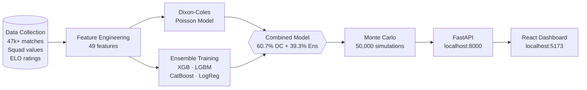

# WC2026 Predictor


End-to-end ML system predicting every FIFA World Cup 2026 match, powered by a Dixon-Coles + gradient-boosted ensemble and 50,000 Monte Carlo simulations.

<!-- Add dashboard screenshot here -->

---

## How It Works



The pipeline trains **Dixon-Coles** and a **gradient-boosted ensemble** independently, then blends them using weights calibrated on WC2018 + WC2022 out-of-sample predictions via `scipy.minimize_scalar`. The blended probabilities feed 50,000 Monte Carlo tournament simulations — each one draws a full bracket, runs every group match, applies proper tiebreaker rules, and plays out all knockout rounds — yielding marginal probabilities for every team at every stage.

---

## Model Performance

| Metric | Value |
|---|---|
| Test accuracy | **60.1%** |
| Test log-loss | **0.881** |
| Brier score | **0.172** |
| WC2022 out-of-sample accuracy | **56.2%** (9 / 16 group-stage matches) |
| WC2022 out-of-sample log-loss | **1.092** |
| WC2018 out-of-sample log-loss | **0.983** |
| Training date | 2026-06-01 |

> The 60.1% test accuracy figure includes qualifiers and friendlies; tournament-only accuracy is lower (see [Honest Limitations](#honest-limitations)).

---

## ML Features

Top 15 features by mean L1-normalised importance across XGBoost, LightGBM, and CatBoost.

| # | Feature | Description |
|---|---|---|
| 1 | ELO Expected Home Win | Home team's win probability implied by pre-match ELO ratings |
| 2 | ELO Diff (adj.) | ELO gap adjusted for venue (neutral ground removes the +100 home bonus) |
| 3 | ELO Difference | Raw ELO rating gap between home and away team |
| 4 | H2H Goal Diff Avg | Average goal-difference across all prior head-to-head meetings |
| 5 | H2H Meetings Count | Total number of prior head-to-head matches played |
| 6 | Away Squad Value | Away team's total Transfermarkt squad market value (€M) |
| 7 | Away ELO Rating | Away team's absolute ELO rating before the match |
| 8 | H2H Away Goals Avg | Average goals scored by the away side in prior H2H meetings |
| 9 | Away Comp. GA (L10) | Away team's goals conceded in last 10 competitive matches |
| 10 | Home Comp. GA (L10) | Home team's goals conceded in last 10 competitive matches |
| 11 | H2H Home Win Rate | Fraction of prior H2H meetings won by the home team |
| 12 | Home GA Last 10 | Home team's goals conceded in last 10 matches (all competitions) |
| 13 | Squad Value Ratio | Ratio of home squad value to away squad value |
| 14 | Home ELO (adj.) | Home team's ELO adjusted for venue context |
| 15 | Tournament Tier | Match importance weight (4=World Cup, 3=continental, 2=qualifier, 1=friendly) |

Full feature set: 49 features across ELO, recent form (last 5 / 10 games), head-to-head history, Transfermarkt squad values, and tournament context.

---

## Tech Stack

| ML / Backend | Frontend |
|---|---|
| Python 3.9 | React 18 |
| XGBoost | Vite |
| LightGBM | Tailwind CSS v3 |
| CatBoost | Recharts |
| scikit-learn | Framer Motion |
| SHAP | lucide-react |
| scipy | React Router v6 |
| Dixon-Coles (custom) | axios |
| FastAPI | |
| uvicorn | |

---

## Getting Started

### Prerequisites

- Python 3.9+
- Node 18+
- ~4 GB free disk space (raw match data + model artefacts)

### Clone and install

```bash
git clone https://github.com/aabdo95/wc2026-predictor
cd wc2026-predictor
pip install -r requirements.txt
```

### Run the full ML pipeline

```bash
make pipeline        # collect → features → train → simulate → explain (~1 hour)
```

Or run each step individually:

```bash
make data            # collect raw datasets (results, ELO, squad values, odds)
make features        # engineer 49 features → data/processed/match_features.csv
make train           # train Dixon-Coles + ensemble → ml/models/
make simulate        # 50,000 Monte Carlo simulations → data/processed/
make explain         # SHAP explanations per match → data/processed/match_explanations.json
```

### Start the backend

```bash
make backend         # FastAPI on http://localhost:8000
```

Swagger docs available at `http://localhost:8000/docs`.

### Start the frontend

```bash
cd frontend
npm install
npm run dev          # Vite dev server on http://localhost:5173
```

---

## Project Structure

```
wc2026-predictor/
├── backend/
│   ├── main.py                    # FastAPI app — startup data loading, 9 REST endpoints
│   ├── schemas.py                 # Pydantic v2 response models
│   └── routers/                   # Split routers: bracket, features, groups, matches
│
├── data/
│   ├── fixtures/                  # Committed — WC2026 draw & schedule
│   │   ├── groups.json
│   │   ├── schedule.json
│   │   └── wc2026_winner_odds.json
│   ├── raw/                       # gitignored — downloaded by `make data`
│   └── processed/                 # gitignored — generated by pipeline
│
├── frontend/
│   ├── src/
│   │   ├── components/            # GroupCard, MatchCard, MatchDetail, KnockoutBracket,
│   │   │                          # MostLikelyBracket, ConfidenceMeter, Navbar, States
│   │   ├── hooks/useApi.js        # Axios hook with cancellation cleanup
│   │   ├── pages/                 # Home, Groups, Matches, Bracket, About
│   │   └── utils/                 # colors.js (design tokens), flags.js (emoji map)
│   ├── tailwind.config.js
│   └── vite.config.js
│
├── ml/
│   ├── collect/                   # Standalone data collectors
│   │   ├── collect_all.py         # Orchestrator
│   │   ├── international_results.py
│   │   ├── elo_ratings.py
│   │   ├── transfermarkt.py
│   │   ├── squad_quality.py
│   │   └── betting_odds.py
│   ├── features.py                # Feature engineering with leakage-prevention contract
│   ├── train_dixon_coles.py       # Dixon-Coles Poisson model training
│   ├── train_ensemble.py          # XGB + LGBM + CatBoost + LogReg ensemble training
│   ├── train.py                   # Orchestrates both training scripts
│   ├── combined_model.py          # Blend weight search via scipy.minimize_scalar
│   ├── simulate.py                # Monte Carlo tournament simulation (50,000 runs)
│   └── explain.py                 # SHAP explanations per match
│
├── Makefile
├── requirements.txt
└── README.md
```

---

## Methodology

### Dixon-Coles Poisson model

Goals in football follow a Poisson process, but the standard independent-Poisson model underestimates draws and 1–0 results. Dixon-Coles (1997) adds a correlation parameter **ρ** that corrects low-scoring match probabilities. This implementation extends it with:

- **ELO-adjusted attack/defence ratings** — team strength feeds directly into the Poisson rate parameters
- **Bayesian shrinkage** (`shrink_prior = 800`) — sparse national teams shrink toward the global mean, preventing overfitting on teams with few matches
- **Temporal decay** — recent matches are weighted higher via an exponential decay factor **γ**

Trained on 47,000+ international matches spanning the full FIFA calendar.

### Gradient-boosted ensemble

Four models are trained on the same 49 engineered features and soft-voted:

| Model | Strength |
|---|---|
| **XGBoost** | Regularised trees; fast hyperparameter search |
| **LightGBM** | Leaf-wise growth; best on high-cardinality form features |
| **CatBoost** | Best individual model accuracy; handles categorical context natively |
| **Logistic Regression** | Calibrated baseline; regularises the ensemble against overfit |

All probability outputs pass through `CalibratedClassifierCV` (isotonic regression) before blending. Training uses a strict **chronological split**: train ≤ 2017, validation 2018–2021, test 2022+, with sample weights doubling World Cup and continental fixtures.

### Combined model (60.7% Dixon-Coles + 39.3% Ensemble)

A scalar blend weight `w` is optimised on WC2018 + WC2022 out-of-sample predictions (128 matches):

```python
result = minimize_scalar(
    lambda w: log_loss(y_true, w * p_ensemble + (1 - w) * p_dc),
    bounds=(0, 1),
    method='bounded'
)
# result.x → 0.393
```

The optimiser settled on **w = 0.393** — the ensemble contributes meaningful lift on top of Dixon-Coles, particularly for ELO-heavy mismatches where Poisson rates alone under-discriminate between opponents.

### Monte Carlo simulation (50,000 runs)

Each simulation:

1. Uses the fixed WC2026 schedule to run all 72 group-stage matches
2. Samples each outcome from the blended home/draw/away probabilities
3. Applies official FIFA tiebreaker rules: points → GD → GF → H2H points → H2H GD → H2H GF → drawing of lots
4. Seeds the 32 qualified teams into the Round of 32 bracket
5. Simulates knockout rounds until a champion is crowned

Marginal reach-probabilities are the fraction of simulations in which a team reached a given round — no closed-form approximation.

### Market prior (75% model + 25% FanDuel odds)

Championship odds are blended with FanDuel closing lines to correct for information the model cannot see (injury news, pre-tournament camp form). The blend is transparent and shown on the dashboard alongside the raw model probability.

---

## Honest Limitations

- **Football has inherent randomness.** The best published models achieve 52–56% match-level accuracy on World Cup data; this model reaches 60.1% on a broad test set that includes qualifiers and friendlies, where the better side wins more reliably than at a major tournament.

- **WC2022 out-of-sample was 56.2%** (9 of 16 group-stage matches predicted correctly). Competitive with the published literature, but well short of certainty.

- **Brazil is underrated by the data model** (4.9% championship probability vs ~9% implied by bookmakers). The 25% market blend partially corrects this, but the gap reflects information that historical statistics cannot capture — squad health, manager tactics, tournament motivation.

- **No live updates.** Predictions are frozen as of the training date (2026-06-01). Injuries, suspensions, or dramatic form swings after that date are not reflected.

- **Sparse squads.** Saudi Arabia's Transfermarkt squad-value features are missing from the source data; the ensemble imputes those features at the model level.

---

## License

MIT
